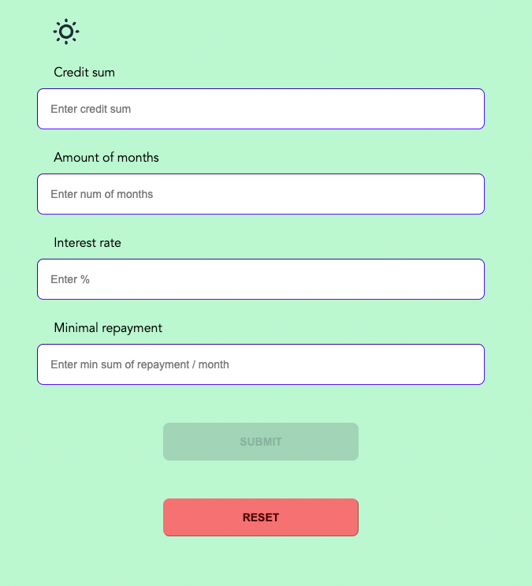
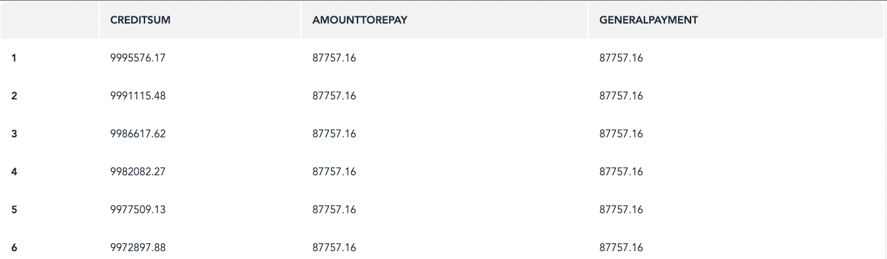

# Credit Estimator Project

A project that's made to calculate a basic repayment calendar according to the inputs made.

# Project tech stack

- Svelte
- TS
- Vite
- TailwindCSS
- daisyUI

## Reason for implementation

Couldn't find any proper mortgage calculator with a possibility to set your own minimal monthly repayment amount to see
how it will affect on the total time of repayment. It uses a basic complex percentage function that applies extra
percentage per following period. It doesn't consider any extra things involved like insurance, etc. Probably in future
that calculator will be extended to be more precise for all the edge cases.

## How to run the app

Once you've fetched the repo, run the following commands:

```
npm run i

make dev
or
npm run dev
```

Project by default will be available at [http://127.0.0.1:5173/](http://127.0.0.1:5173/).

## How to use the app



At the moment the app is represented with the following functionality:

- Light/Dark theme switcher
- Field to enter the whole sum of credit
- Field to enter the number of months to repay the credit
- Field to enter the Interest rate in percentage
- (OPTIONAL) field to enter the minimum monthly repayment amount. **NOTE!** if it will be less than base repayment
  amount
  per month then this field input won't be taken into consideration while calculating.
- Buttons to calculate & reset the form

Once you've pushed the Submit button you'll be scrolled down to the calculations' table as shown in the following
example


## How to use this app inside another app

If you want to mount and use this app inside your app feel free to find all the necessary exports inside `dist` folder
in the root of the project.

You may find the signature of an exported function inside `src/lib.ts` file. At the moment exported function returns an array of two elements:

- Instance of the app
- Function to use in the lifecycle (or anywhere you need) to unmount the app

#### This app and readme may be extended in future!
